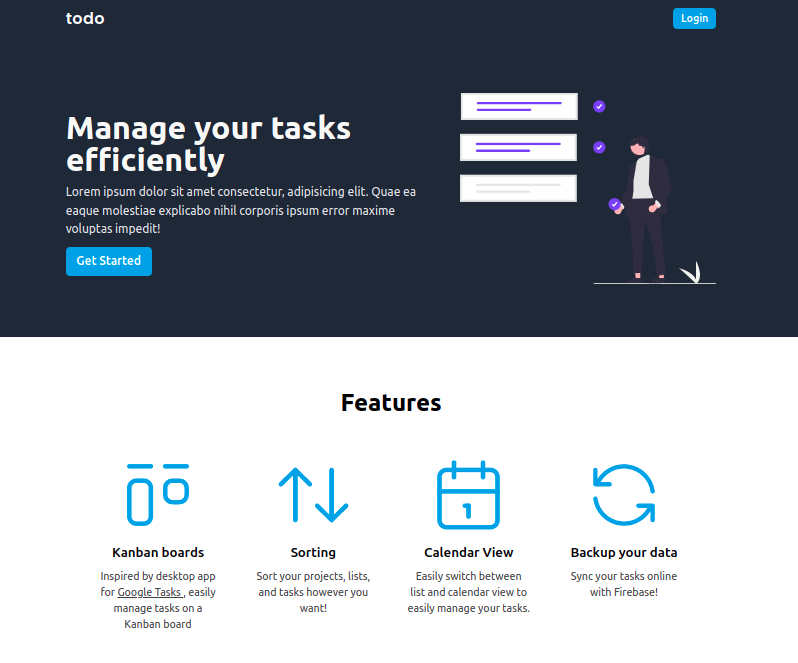
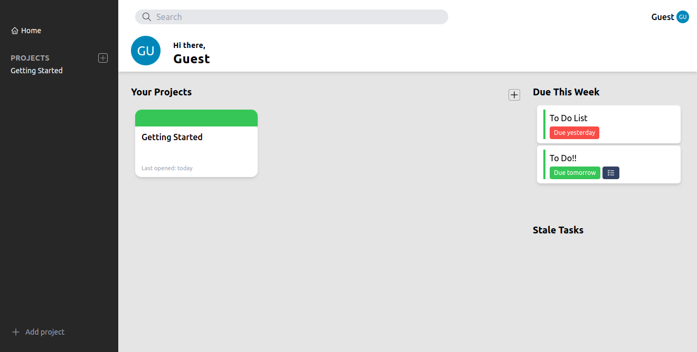
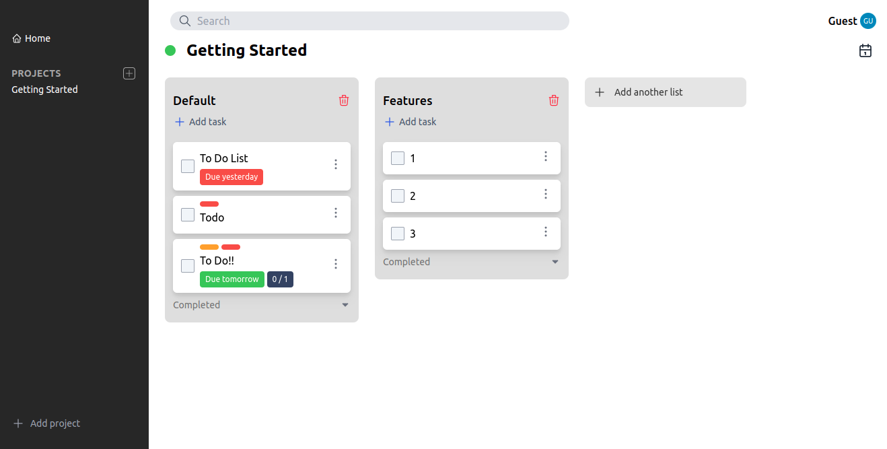
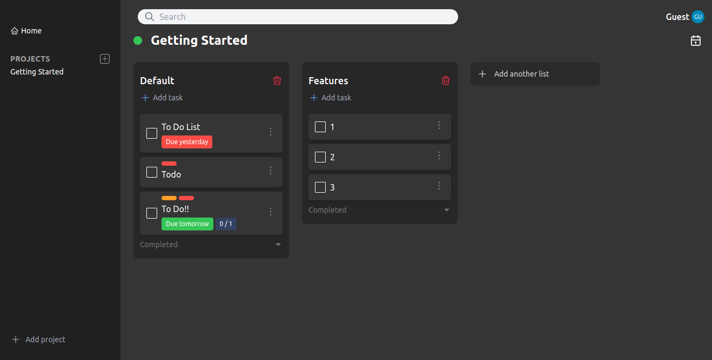

# todo

A full-featured task management app. Inspired by Trello and [Desktop app for Google Tasks](https://chrome.google.com/webstore/detail/desktop-app-for-google-ta/lpofefdiokgmcdnnaigddelnfamkkghi?hl=en").

This is a project for The Odin Project.

## Features

- Kanban board
- Sorting of projects, lists, and tasks
- Markdown support for task notes
- Calendar view for tasks
- Online syncing with Firebase with a localStorage fallback
- Advance search functionality
- Responsive
- Dark mode
- Accessible
- Keyboard interactive

## Technologies

- [`poor-man-jsx`](https://github.com/lemonadee71/poor-man-jsx) the backbone of this project. Handles the rendering of the components.
- [`navigo`](https://github.com/krasimir/navigo) for routing
- [`tailwindcss`](https://tailwindcss.com/) for styling
- [`Sortable`](https://github.com/SortableJS/Sortable) for sorting and drag and drop functionality
- [`popper`](https://popper.js.org/) for positioning of tooltips and popovers
- [`tui.calendar`](https://github.com/nhn/tui.calendar) for calendar view
- [`toastify-js`](https://github.com/apvarun/toastify-js) for toasts

...and more. See [package.json](package.json) for full list.

## Preview

### Dashboard

### Project page

### Project page (Dark mode)

### Calendar view

## Resources

All icons are from [Tabler Icons](https://tablericons.com/) and hero image from [Undraw](https://undraw.co/).

## Reflections

I first finished this project back in February 2021 then refactored it a month later because I wanted to practice the pubsub pattern. I did not plan to refactor it, I just happened to checked on another todo project and saw they used pubsub and thought it was cool. Then I decided to worked on it after releasing version 1 of `poor-man-jsx` and the game jam which was August 2021. I forgot why but I decided to make this my final JS project and work and use my own library instead of React. So I did just that and worked on `poor-man-jsx` and this project in parallel. If I found issues or need new features to make writing components easier, I'll implement it on `poor-man-jsx` then come back here and I repeated that till I reached the point where I'm satisfied with the features my own library has right now. There's still lots of bugs but I learned a lot going through that process and at the point that I am confident with my JS skills. Due to some circumstances and me adding more and more features, it took me a year to finish the refactor. While that's a long time away and might be time I could have spent on learning frameworks, I don't regret what I did as it gave me a valuable experience. I also appreciate frameworks better now after creating something similar myself.
